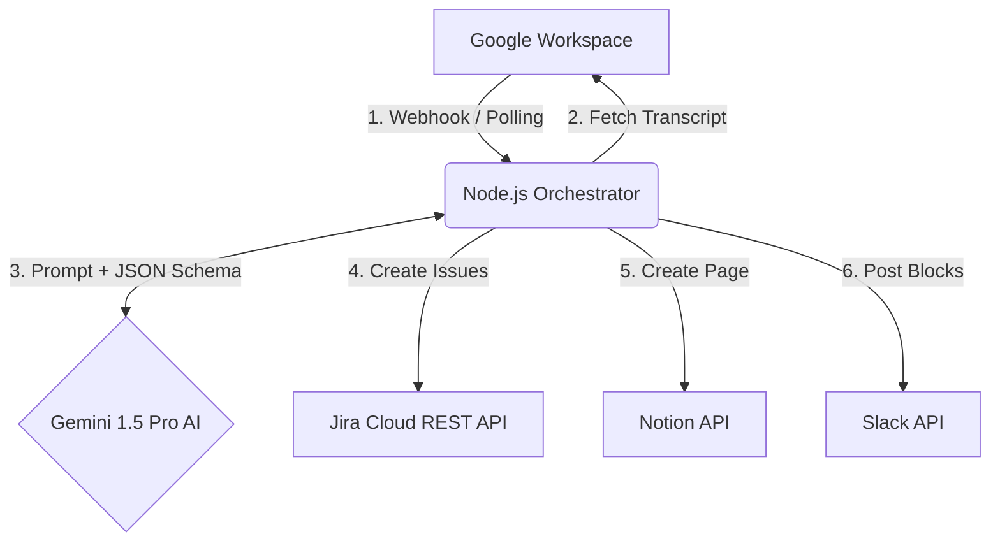

# Architecture Document

This document explains the technical architecture of the AI Meeting Workflow Automation system.

## System Overview

The system is designed as a **Node.js/TypeScript Event-Driven Microservice**. It is meant to be run continuously on a server (or serverless environment) to listen for Google Meet events and orchestrate a linear processing pipeline across multiple third-party SaaS platforms (Google, Atlassian, Notion, Slack).

## Architectural Decisions

### 1. TypeScript over Vanilla JavaScript
**Decision:** The project uses TypeScript.
**Rationale:** The system interacts with 5 different external APIs, each expecting highly specific JSON payloads. TypeScript interfaces (`src/types/index.ts`) provide compile-time guarantees that data mapping from Gemini's output to Jira/Notion payloads is perfectly aligned, drastically reducing runtime crashes.

### 2. Dual-Trigger Strategy (Webhook + Long-polling)
**Decision:** The orchestrator implements both an HTTP server listening for `google.workspace.meet.conference.v2.ended` webhooks, AND a `setInterval` backup poller.
**Rationale:** Webhooks can fail or get dropped due to network issues. The backup poller guarantees eventual consistency by sweeping the Meet API for any conferences that were missed.

### 3. Structured Outputs with LLMs
**Decision:** Gemini is constrained using strict `responseSchema` JSON typing.
**Rationale:** Standard LLM outputs are non-deterministic strings. By forcing Gemini to output a guaranteed JSON schema, the application can securely iterate over `actionItems` using standard `Array.prototype.map` without writing brittle Regex parsers.

### 4. Modular Service Pattern
**Decision:** The `/src/services/` directory isolates vendor-specific SDK logic.
**Rationale:** The `index.ts` orchestrator is completely agnostic to *how* a Notion page is created or *how* a Jira ticket is made. It only calls `createJiraTickets(data)`. This allows a developer to easily swap Jira out for Asana or Trello in the future by simply rewriting the `jira.ts` file without touching the core business logic.

## Data Flow

1. **Trigger Event:** `conferenceRecords/space-id` is detected.
2. **Data Aggregation:** Application streams the transcript text from Google Drive/Meet into memory.
3. **Data Transformation:** The raw text is shipped to Gemini. The LLM acts as the transformation layer, converting unstructured human language into a typed `MeetingData` object.
4. **Data Dissemination:** 
   - `ActionItems` route to Jira.
   - `Summary` and `Decisions` route to Notion.
5. **Notification:** The final aggregate object `ProcessedMeeting` is formatted into Markdown/Blocks and routed to Slack.

## Error Handling & Resiliency

* **Statefulness:** The system uses a `Set` cache (`processedConferencesCache`) to ensure a single meeting is never processed twice, avoiding duplicate Jira tickets.
* **Graceful Degradation:** If the Notion API is down, the system catches the error, logs it, and continues to the Slack stage so the team is still notified that the meeting was analyzed. 
* **Safety Guardrails:** A `CONFIDENCE_THRESHOLD` environment variable ensures that if Gemini returns a confidence score below 80% (indicating poor audio or an ambiguous transcript), the system aborts ticket creation and alerts a human via Slack to manually review the meeting.
